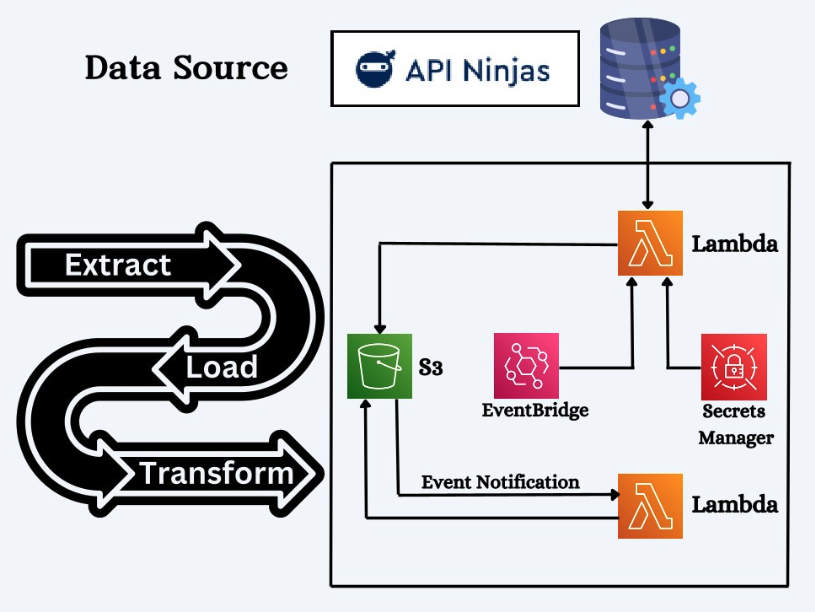

# 📈 Real-Time Stock Market Data Pipeline & Analysis

## Overview

This project implements a **real-time stock market data pipeline** using **AWS services**, following an **event-driven ELT (Extract, Load, Transform) architecture**. The workflow is orchestrated using **AWS Step Functions**, which **automate the data processing pipeline on a weekly schedule**. The pipeline **collects, processes, and analyzes stock market data** efficiently, ensuring **scalability, reliability, and real-time insights**.

---

## 🛠️ Architecture Diagram

---

## 📌 Key Features

✅ **Automated Data Ingestion**: Uses AWS services like Lambda, EventBridge, and S3 to collect stock market data in real-time.  
✅ **Scalable Data Storage**: Stores raw and processed data in **S3** with optimized partitioning.  
✅ **Query & Analytics**: Uses **AWS Athena** for querying structured stock data.  
✅ **Event-Driven Orchestration**: Automates processing workflows using **Step Functions**.  
✅ **Visualization & Insights**: Integrates with **AWS QuickSight** for interactive dashboards.

---

## 📸 Project Explanation

For a **detailed breakdown of this project**, check out my LinkedIn post:

🔗 **[LinkedIn Post: Real-Time Stock Market Data Pipeline](https://www.linkedin.com/posts/thenischald_end-to-end-stock-market-data-pipeline-activity-7296333629570375681-wk6Q?utm_source=share&utm_medium=member_desktop&rcm=ACoAADfIHK0Bvh1lWE2y3w0SQ4guTIHdj0yEDk4)**
